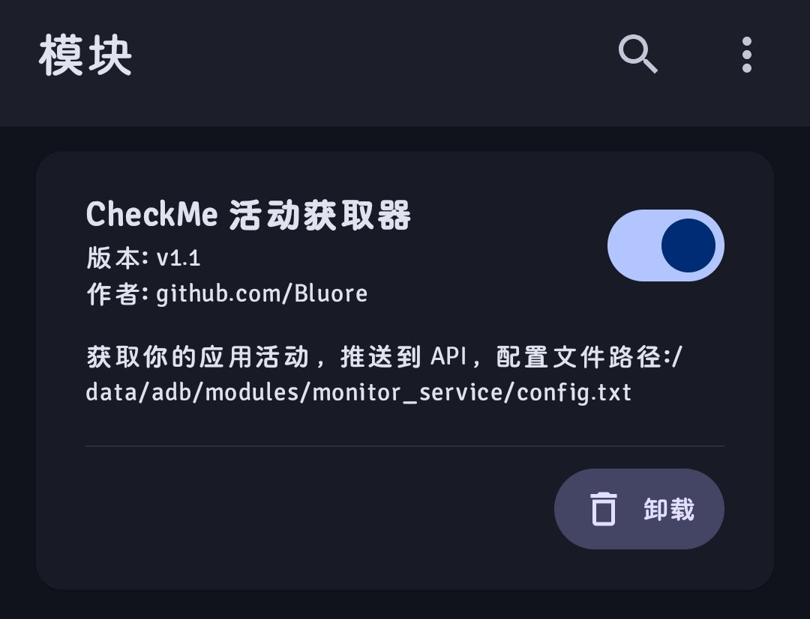

# CheckMe-Client-MKSH

## 简介

`CheckMe-Client-MKSH` 是用于 `CheckMe` 项目的移动端（Android）数据采集模块实现，采用 Shell 脚本与 Magisk/模块化机制集成。该模块在设备启动或后台运行时采集所需的系统与应用数据（如前台窗口、进程信息、媒体播放信息等），并按后端接口格式上报到 `CheckMe` 服务端。

> 相关项目
>
> - 后端服务：Bluore/CheckMe
> - 前端展示：Bluore/CheckMe-Front
> - 桌面端采集：Bluore/CheckMe-Client-Python

## 运行环境与前置要求

- 设备：Android
- 权限：需要系统/Root 权限

## 安装与部署

1. 压缩整个目录

2. 刷入到`Root管理器`，重启生效



## 配置

在 `.config.txt` 中修改后端 API 地址、上报频率以及采集字段。

```txt
api_base=http://localhost:1145/api/v1
token=your_token
device=phone
interval_seconds=60
```

## 测试与调试

- 手动运行采集脚本：

```sh
/data/adb/modules/CheckMe-Client-MKSH/monitor.sh
```

- 查看日志 `monitor.log`

## 卸载

1. 使用`Root管理器`卸载模块。
2. 手动卸载：运行仓库内的 `uninstall.sh` 或手动移除模块目录并清理残留配置。

```sh
sh /data/adb/modules/CheckMe-Client-MKSH/uninstall.sh
```

## 相关链接

- 后端仓库：https://github.com/Bluore/CheckMe
- 前端展示：https://github.com/Bluore/CheckMe-Front
- 桌面端采集：https://github.com/Bluore/CheckMe-Client-Python
